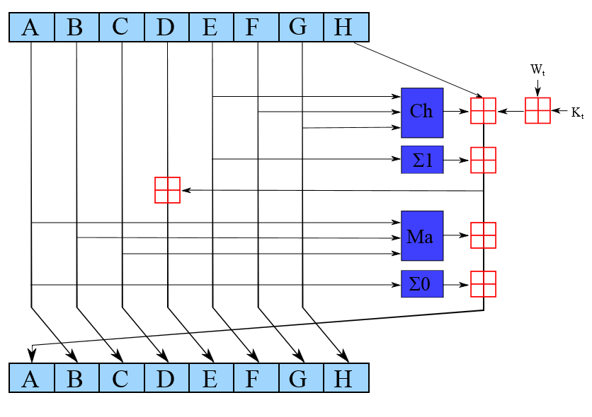

# Описание.

Этот проект предназанчен для визуализации алгоритма SHA-256. Отображение основых регистров , сложения , смещения основного сообщения.
Работа показана как в цикле без остановки, так и по шагам (нажимая на клавишу N/Next). Можно откатить шаг назад (нажав клавишу P/Previous).
Запуск программы без остановки R/run. Пауза в вычислениях S/stop.  Прекращение выполнеия программы Esc.

Результатом работы программы является хеш  по SHA-.
[Описание работы SHA-2]( https://en.wikipedia.org/wiki/SHA-2)

# Описание обозначений.

$\pmb\oplus$ = XOR

\>\>\>  -  смещение вправо

<<<    -  смещение влево

$\pmb\lnot$  - инверсия, логическое отрицание

**Ch(E,F,G)** - 

**Ma(A,B,C)** -

$\sum_0(A)$ =

$\sum_1(E)$ =

